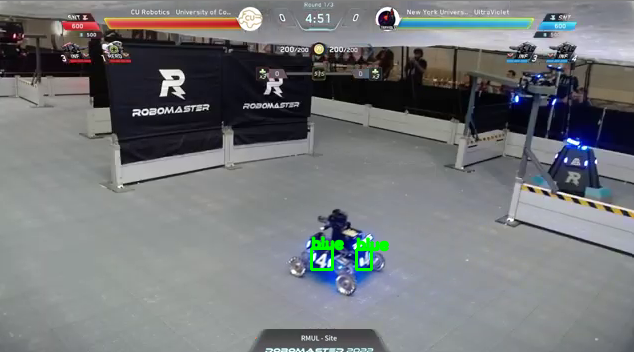

# RobomastersMidterm2why
Name: Nirav Golyalla

## Submission questions
### Design Decisions
#### Part 1 
For part 1, I made 2 modules, one that handled all the model parts, one that handled all the visualization parts. This was so it was easy to deal with the cv stuff and the pytorch prediction stuff. It is also modularized so that one part could be replaced with the other because they aren't dependent on each other, and parts could be replaced easy as long as they output the same formats. For blue detection only, I used thresholding, because it was simple
### Prompt 2
- I realised that Prompt 1 did 90% of the work that prompt 2 needed, added it as a small addition to prompt 1 work. This allowed me to add a simple part to my prompt 1 work to make prompt 2 work
### Prompt 3:
- Not sure how to run the verison part, just did the setup to run main.py, which will print the version on startup. I think it will run on startup. For service type, I used simple so that it would run on startup normally instead of something complicated. Running main on startup seems appropriate because thats the main working loop we need when running the algorithm

    

